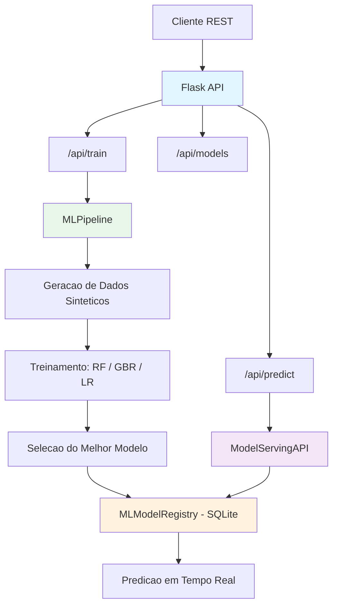
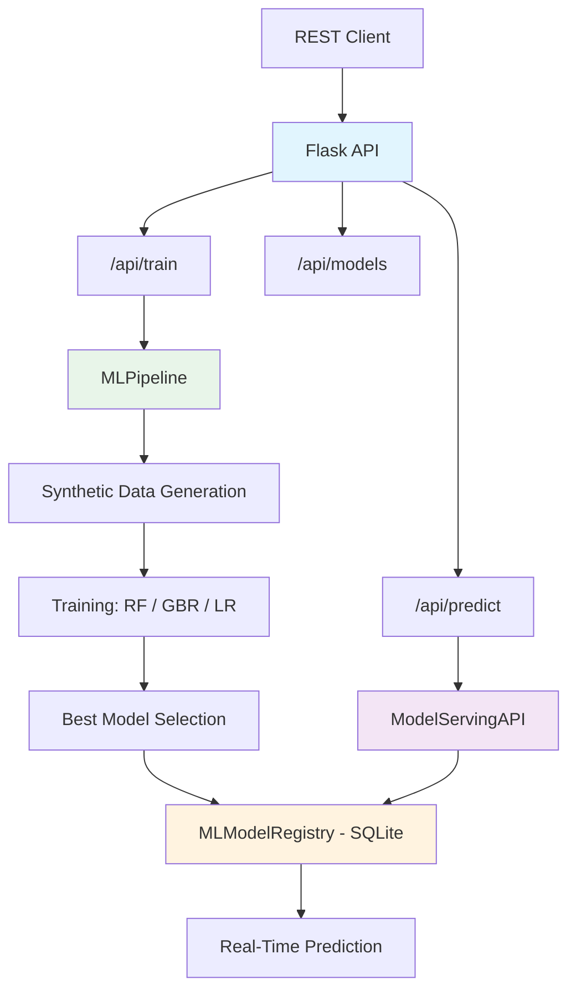

<div align="center">

# IBM Machine Learning Capstone

[](https://python.org)
[](https://scikit-learn.org/)
[](https://flask.palletsprojects.com/)
[](https://mlflow.org/)
[](Dockerfile)
[](LICENSE)

Projeto capstone do IBM Machine Learning Professional Certificate -- plataforma MLOps com pipelines de treinamento, registro de modelos, API de predicao e serving via Flask.

Capstone project from the IBM Machine Learning Professional Certificate -- MLOps platform with training pipelines, model registry, prediction API, and serving via Flask.

[Portugues](#portugues) | [English](#english)

</div>

---

<a name="portugues"></a>
## Portugues

### Sobre

Este projeto foi desenvolvido como capstone da certificacao profissional IBM Machine Learning. A plataforma implementa um ciclo completo de MLOps: geracao de datasets sinteticos (churn de clientes e precos de imoveis), treinamento e comparacao automatica de modelos (Random Forest, Gradient Boosting, Logistic Regression, Linear Regression), versionamento em banco SQLite com registro de metricas, e serving de predicoes via API REST Flask. O sistema seleciona automaticamente o melhor modelo com base em acuracia (classificacao) ou RMSE (regressao) e o disponibiliza para inferencia em tempo real. O projeto exercita conceitos de engenharia de ML como pipelines automatizados, model registry e monitoramento de predicoes.

### Tecnologias

| Tecnologia | Descricao |
|---|---|
| Python 3.12 | Linguagem principal |
| scikit-learn | Treinamento e avaliacao de modelos (RF, GBR, LR) |
| Flask | API REST para treinamento e predicao |
| MLflow | Gerenciamento do ciclo de vida de modelos |
| Pandas / NumPy | Manipulacao de dados e computacao numerica |
| Plotly | Visualizacoes interativas |
| SQLite | Registro de modelos, experimentos e predicoes |
| Docker | Containerizacao para deploy |

### Arquitetura



### Estrutura do Projeto

```
ibm-machine-learning-capstone/
├── config/
│   └── mlflow_config.py
├── src/
│   ├── ml_platform.py              # Pipeline ML, registro e serving
│   ├── main_platform.py            # Dashboard Streamlit
│   ├── serving/
│   │   └── app.py                  # API Flask de serving
│   ├── data/
│   ├── models/
│   ├── monitoring/
│   ├── scripts/
│   └── utils/
├── tests/
│   ├── __init__.py
│   ├── performance_test.py
│   ├── test_platform.py
│   ├── unit/
│   └── performance/
├── k8s/
│   └── service-api.yaml
├── Dockerfile
├── CONTRIBUTING.md
├── requirements.txt
├── LICENSE
└── README.md
```

### Inicio Rapido

```bash
# Clonar o repositorio
git clone https://github.com/galafis/ibm-machine-learning-capstone.git
cd ibm-machine-learning-capstone

# Criar ambiente virtual
python -m venv venv
source venv/bin/activate  # Windows: venv\Scripts\activate

# Instalar dependencias
pip install -r requirements.txt

# Executar pipeline de treinamento + API
python src/ml_platform.py

# Ou executar apenas o servidor de serving
python src/serving/app.py
```

### Docker

```bash
docker build -t ibm-ml-capstone .
docker run -p 8000:8000 ibm-ml-capstone
```

### Testes

```bash
pytest
pytest --cov --cov-report=html
pytest tests/test_platform.py -v
```

### Aprendizados

- Implementacao de pipelines completos de MLOps (treinamento, avaliacao, registro, serving)
- Comparacao automatica de algoritmos e selecao do melhor modelo
- Versionamento de modelos com model registry em SQLite
- Deploy de modelos como APIs REST com Flask
- Geracao de datasets sinteticos para simulacao de cenarios reais (churn, precos)
- Monitoramento de predicoes com logging estruturado

### Autor

**Gabriel Demetrios Lafis**
- GitHub: [@galafis](https://github.com/galafis)
- LinkedIn: [Gabriel Demetrios Lafis](https://linkedin.com/in/gabriel-demetrios-lafis)

### Licenca

Este projeto esta licenciado sob a [Licenca MIT](LICENSE).

---

<a name="english"></a>
## English

### About

This project was developed as a capstone for the IBM Machine Learning Professional Certificate. The platform implements a complete MLOps cycle: synthetic dataset generation (customer churn and house prices), automated model training and comparison (Random Forest, Gradient Boosting, Logistic Regression, Linear Regression), versioning in an SQLite database with metric registration, and prediction serving via Flask REST API. The system automatically selects the best model based on accuracy (classification) or RMSE (regression) and makes it available for real-time inference. The project exercises ML engineering concepts such as automated pipelines, model registry, and prediction monitoring.

### Technologies

| Technology | Description |
|---|---|
| Python 3.12 | Core language |
| scikit-learn | Model training and evaluation (RF, GBR, LR) |
| Flask | REST API for training and prediction |
| MLflow | Model lifecycle management |
| Pandas / NumPy | Data manipulation and numerical computing |
| Plotly | Interactive visualizations |
| SQLite | Model, experiment, and prediction registry |
| Docker | Containerization for deployment |

### Architecture



### Project Structure

```
ibm-machine-learning-capstone/
├── config/
│   └── mlflow_config.py
├── src/
│   ├── ml_platform.py              # ML pipeline, registry, and serving
│   ├── main_platform.py            # Streamlit dashboard
│   ├── serving/
│   │   └── app.py                  # Flask serving API
│   ├── data/
│   ├── models/
│   ├── monitoring/
│   ├── scripts/
│   └── utils/
├── tests/
│   ├── __init__.py
│   ├── performance_test.py
│   ├── test_platform.py
│   ├── unit/
│   └── performance/
├── k8s/
│   └── service-api.yaml
├── Dockerfile
├── CONTRIBUTING.md
├── requirements.txt
├── LICENSE
└── README.md
```

### Quick Start

```bash
# Clone the repository
git clone https://github.com/galafis/ibm-machine-learning-capstone.git
cd ibm-machine-learning-capstone

# Create virtual environment
python -m venv venv
source venv/bin/activate  # Windows: venv\Scripts\activate

# Install dependencies
pip install -r requirements.txt

# Run training pipeline + API
python src/ml_platform.py

# Or run serving server only
python src/serving/app.py
```

### Docker

```bash
docker build -t ibm-ml-capstone .
docker run -p 8000:8000 ibm-ml-capstone
```

### Tests

```bash
pytest
pytest --cov --cov-report=html
pytest tests/test_platform.py -v
```

### Learnings

- Implementing complete MLOps pipelines (training, evaluation, registration, serving)
- Automated algorithm comparison and best model selection
- Model versioning with model registry in SQLite
- Deploying models as REST APIs with Flask
- Generating synthetic datasets for real scenario simulation (churn, prices)
- Prediction monitoring with structured logging

### Author

**Gabriel Demetrios Lafis**
- GitHub: [@galafis](https://github.com/galafis)
- LinkedIn: [Gabriel Demetrios Lafis](https://linkedin.com/in/gabriel-demetrios-lafis)

### License

This project is licensed under the [MIT License](LICENSE).
